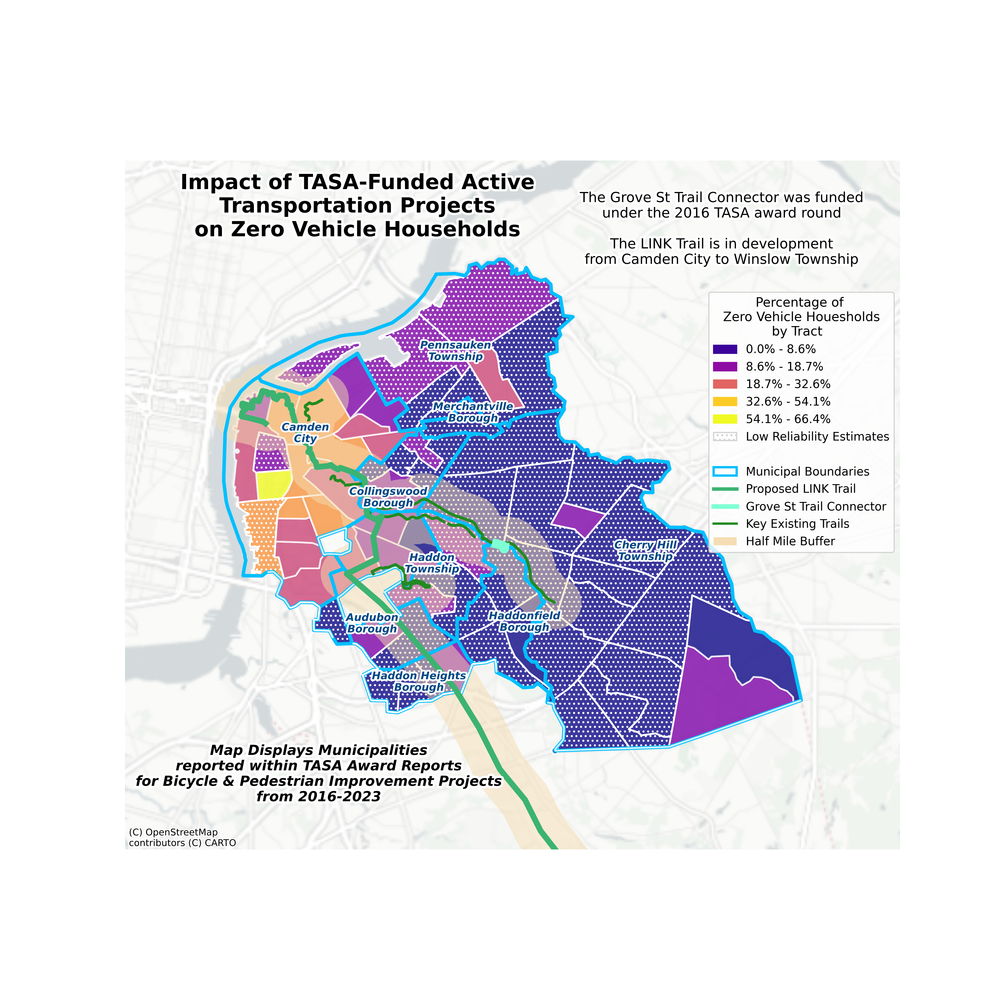
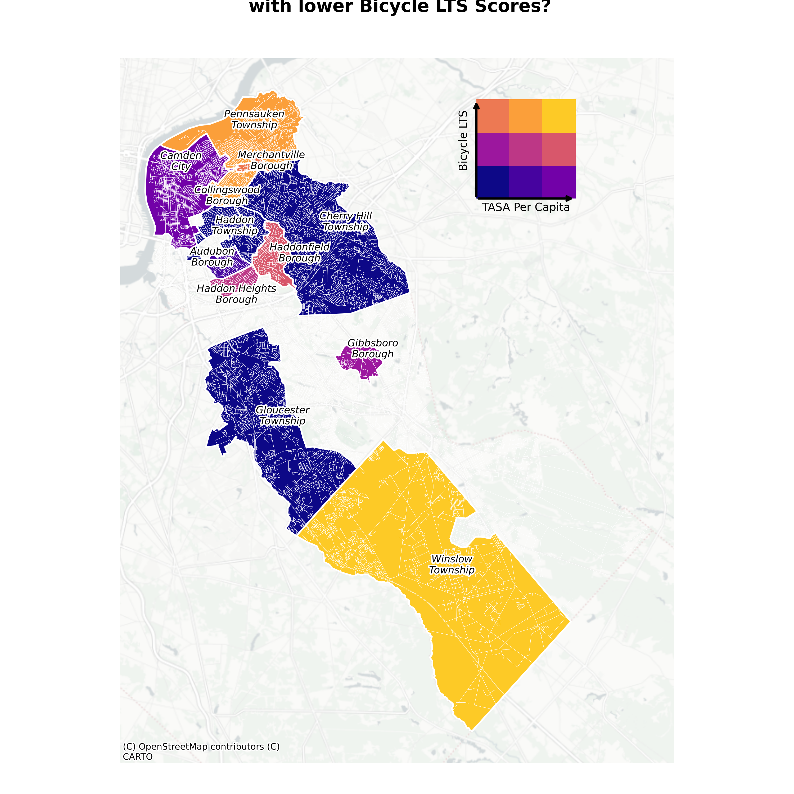

# Distribution of Transportation Alternatives Set-Aside (TASA) Funding for Bicycle & Pedestrian Improvements in New Jersey

by: Rebecca Levitsky  
for: my Command-Line GIS Final Project, and my own interests  
date last updated: 12/16/24

## Intro
The goal of this page is to gain insight into how TASA funds are spatially distributed in New Jersey.  The federal TASA program is the [largest source of funding](https://www.fhwa.dot.gov/environment/bicycle_pedestrian/funding/) for Bicycle & Pedestrian projects in the US, though there are many, many other federal and state programs that fund active transportation projects as well.  The visuals that follow do not include information from these other programs, for several reasons - as it turns out, exact dollar amounts dedicated to bicycle & pedestrian improvements is a surprisingly tedious number to arrive at:
- different funding programs (at both federal and state levels) have different reporting requirements, and agencies (the USDOT or NJDOT, in this case) don't always publish award reports for every distinct program.
- many projects that use other sources of funding (let's say, a bridge repair), might involve bicycle & pedestrian improvements, but don't report the funding levels for these aspects.
- if obligation funds (the dollar amount that was paid back to the grantee by the USDOT or NJDOT) *are* reported and publicly available, they are usually done so in an unusable format, such as a PDF that the best of pdf to csv converters could not begin to parse.

This is not to say that current practices are without reason - federal funding for transportation and the reporting requirements that come with it is an exceedingly complex topic that many a PhD is dedicated to understanding.  I won't be delving into the intricacies of this process, mostly because I imagine that the only people who will want to open this site are people I have already ranted to at length about the aforementioned difficulties.  If you are curious about how transportation infrastructure gets funded in the US, this Congressional Research Service report on [Federal Highway Programs](https://crsreports.congress.gov/product/pdf/R/R47022) is an excellent place to start.  But, for our purposes, the key here is that understanding where funding is going for active transportation is a harder question to arrive at than it may seem.

So, for this project, we will focus on what we know.  The Federal Highway Administration (FHWA) publishes [Annual Reports](https://www.fhwa.dot.gov/environment/transportation_alternatives/annual_reports/) on TASA grant awards and obligation rates by state - though the site urges caution in using these reports to compare states, for all of the reasons listed above.  The excel sheets that house the awards are meant for excel, and excel only, and divide TASA dollars by awards for different set-asides within the larger program.  The Safe Routes to School Program, the Recreational Trails Program .  But, they can be cross checked with the TASA awards that NJDOT publishes on its [Local Aid Resource Center](https://njdotlocalaidrc.com/federally-funded-programs/transportation-alternatives) (a remarkably user-friendly website, as someone who has spent far too much time on other DOT websites.) So, after dedicating some time to understanding the FHWA excel reports, I compiled the awards for New Jersey into an exportable csv format, and went to work. $106,679,000 million

In New Jersey, TASA funds are not distributed every year - awards have been administered for 2016, 2018, 2020, and 2023.  All the awards reported in the FHWA data were cross checked with the NJDOT documents to ensure accuracy.  The distribution of funds is a joint process conducted by the NJDOT and the state's three Metropolitan Planning Organizations (MPOs):
- North Jersey Transportation Authority (NJTPA)
- Delaware Valley Regional Planning Commission (DVRPC)
- South Jersey Transportation Planning Organization (SJTPO)

MPOs are *very important* for transportation planning and advancing active transportation goals - again, I won't get into the details, but keep in mind that they are federally-designated regional planning bodies that are tasked with managing a *region* as opposed to a specific city or county.  They exist because the greater Philadelphia region, for example, has its own unique needs and really should be considered as a whole when making strategic long-term plans and improvements.  There is a lot of coordination between MPOs, state DOTS, and local governments, and their capacity, priorities, and resources have a *huge* impact on the transportation infrastructure we all use every day. 

## Data Sources
The primary bulk of my data came from the **FHWA TASA Spending Reports** mentioned above.  They are published annually, but not updated, as they contain awards for distinct years. I manually compiled the relevant information in Excel before exporting to a csv.  Before exporting, they were *thoroughly* checked against the NJDOT's award information. 
- these reports include each project as a row, so once they were loaded in python, the pandas library was used to split up each municipality
- **Importantly**, for projects that touched multiple municipalities, the total award amount was divided evenly among each municipalities.  This is because there doesn't seem to be a standard logic (or documentation to that effect) as to how many municipalities get reported with the award.  The project is within the reported municipality, but there are some projects of regional significance that have several municipalities awarded.
    - For example, the Grove Street Trail Connector in Camden County is a signficant project.  Grove Street runs from Haddonfield Borough to Cherry Hill Township, and the Connector      (situated on the municipal boundary dividing Haddonfield Borough and Cherry Hill Twp) will greatly improve the connectivity of the Cooper River Trail.  However, *Haddonfield Borough was not listed under the municipalities 'awarded' within this project*.  As such, I manually added this in, as this project provides a clear benefit to this municipality.  This was the only such project that had more than 2 or 3 municipalities listed, so I did not make this adjustment for any other municipality. 
Other data sources included:
- ACS 5-Year estimates (2022), accessed from the census library, for both county subdivision data and tract-level data
    - many municipality names had to be edited slightly due to the way they are reported in the Census: 'Atlantic city city', for example, was adjusted to 'Atlantic City'
- TIGERLine boundary files for county subdivisions and census tracts, accessed through the pygris library
    - boundaries are from 2020 
- DVRPC data from their lovely [data center](https://www.dvrpc.org/data/), including:
    - Greater Philadelphia Trails, which were clipped to New Jersey, and filtered for paved trails in the Camden Area (shorter trails were also removed)
        - data last updated 11/12/24
    - Bicycle Level of Traffic Stress Network, which was similary clipped to the Camden area for visualization
        - data last updated 11/12/24
- A few [geojson.io](https://geojson.io/#map=2/0/20) files I compiled myself, mostly to show the Camden County LINK Trail and one particular TASA-funded project I found to be key towards this larger project. Projects were referenced to Camden County documents on these specific projects to ensure accuracy

## Alright, Onward!

This webmap provides an overview of all municipalities in New Jersey that have received funding through the TASA program for Bicycle & Pedestrian Improvement Projects:

    <iframe src="fundingmap.html" 
            style="width: 100%; height: 600px; border: none;">
    </iframe>

you can also explore this map [as its own webpage here](fundingmap.html)

## Some Static Maps for Further Context

### County-Level Funding
This map shows all awards at the county level.  Awards were grouped by the county they were in, and population data was gathered from the 2022 ACS 5-year Estimates.  TASA awards reveal some pretty interesting patterns when visualized by the total dollar amount, by the number of awards, and by the award level per capita:

    

<em>Figure 1: TASA funding by Counties in New Jersey.</em>

### Zoom in to the DVRPC Region
Same approach, but with municipal-level data intact and just zoomed in to show how this works out in the DVRPC New Jersey Region, which includes Burlington, Camden, Gloucester, and Mercer Counties:

    

<em>Figure 2: DVRPC-level funding breakdown.</em>

### Let's Zoom in Even Further to Camden
So, what is the importance of all of this? I'm not even sure I began to arrive at an answer there.  Only that this is a huge pot of money that requires a lot of resources to access and even more to implement effectively and equitably.  And, it has resulted in some really cool projects!  Here's a snapshot of what I am calling greater Camden, with a pretty significant project that was funded in the 2016 TASA round: the Grove Street Trail Connector.

The Grove Street Trail Connector will provide a key connection along the Cooper River Trail - where this trail crosses Grove Street, there were previously no accommodations for bicyclists and pedestrians.  In fact, there was a large concrete median smack dab in the middle of the crossing, and trail users had to cross the river and go a full block into Haddonfield to access a crosswalk.  This project is important because it will improve connection to the proposed [Camden County LINK Trail](https://www.camdencounty.com/service/parks/cross-county-trail/), a huge regional project to connect municipalities in Camden County.  Segements of the LINK Trail have also been funded through TASA (looking at you, Winslow Township).

    

<em>Figure 3: Camden Municipalities that have received TASA funding, and some other stuff.</em>

### Contact
If you have questions or suggestions, feel free to reach out! You can reach me at:
- Rebecca Levitsky
- rebecca.levitsky@gmail.com

### Bonus: Weighted LTS Scores & TASA Funding
*just a little addition, still a work in progress* 
And finally, here is a rabbit hole I went down of trying to make a bivariate choropleth map that shows leveling of TASA funding per capita vs the average bicycle level of traffic stress (LTS) in a given municipality. LTS segements were weighted by their length, then grouped by municipality and averaged out.  So, the average LTS score for a given municipality reflects the amount of roadway miles they have.  I was only working with 12 rows here, so I was really stretching some of these jenks.  But, it matches my understanding of the data and I think it is an interesting rabbit hole I may explore further.  I spent the least amount of time fine tuning this one, but may come back to it:

    

<em>Figure 4: [Working] Map showing Bike LTS and TASA funding relationship.</em>

  

